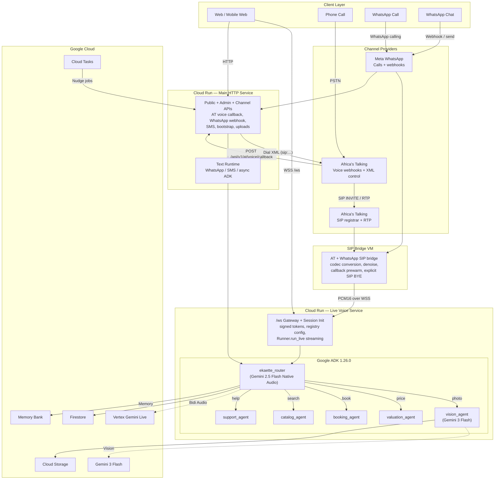

# Ekaette — Multimodal AI Customer Service Agent

[](https://python.org)
[](https://fastapi.tiangolo.com)
[](https://google.github.io/adk-docs/)
[](https://ai.google.dev/gemini-api/docs/live)
[](https://react.dev)
[](https://tailwindcss.com)
[](https://cloud.google.com/run)
[](LICENSE)

> **Ekaette** transforms customer service through real-time multimodal AI conversations — customers speak naturally, show products via camera, negotiate prices, and book appointments, all in one voice call or WhatsApp chat. Built for the [Gemini Live Agent Challenge](https://geminiliveagentchallenge.devpost.com/).

[Live Demo](https://ekaette-233619833678.us-central1.run.app) | [Demo Video](https://youtube.com/watch?v=XXXXX) | [Blog Post](https://dev.to/bassey/building-ekaette-XXXXX) | [Devpost](https://devpost.com/software/ekaette)

---

## Demo

### Video Walkthrough

<!-- TODO: Replace VIDEO_ID with your actual YouTube video ID -->
[](https://www.youtube.com/watch?v=VIDEO_ID)

### Screenshots

| Voice Conversation | Visual Inspection | Valuation & Negotiation |
|---|---|---|
|  |  |  |

---

## The Problem

Traditional e-commerce customer service forces customers into slow, text-only chatbot flows — typing descriptions of products they could simply *show*, negotiating prices through rigid forms, and navigating multi-step booking flows that should take seconds. In Nigerian markets especially, trade-in valuations, price negotiation, and appointment scheduling are deeply conversational acts that text chatbots fail to capture.

## What Ekaette Does

Ekaette is a **multimodal AI customer service agent** that handles the full trade-in lifecycle through natural conversation — voice or text:

- **See**: Customer shows their device on camera or sends a photo via WhatsApp — AI identifies the product, assesses condition, and spots damage
- **Hear**: Bidirectional native-audio streaming via Vertex Gemini Live — with a dedicated live voice service for long-lived real-time sessions
- **Value**: Automated condition grading with brand-specific diagnostic questionnaires and transparent itemized pricing deductions
- **Negotiate**: Natural price negotiation with counter-offers — "I was quoted 550k but I want 500k" works on both voice and WhatsApp
- **Book**: Appointment scheduling and pickup confirmation, all within the same conversation
- **Remember**: Long-term memory across sessions — returning customers are greeted by name with context from prior interactions
- **WhatsApp**: Full-featured WhatsApp Business channel — text, image, video, and voice note replies with typing indicators and silence nudges
- **Phone**: PSTN phone calls via Africa's Talking voice callback control plane plus a SIP bridge VM for codec conversion, denoise, callback prewarm, and explicit call control

One codebase serves **6 industries** (electronics, hotel, automotive, fashion, telecom, aviation) with per-industry voice personas, pricing rubrics, and conversation styles. All channels still converge on **one AI brain** — the same ADK agent graph, tools, session state, and memory — but through channel-appropriate ingress paths.

---

## Architecture



**Reference deployment**: Ekaette uses a split architecture. The main Cloud Run service handles HTTP APIs, webhooks, AT XML call control, callback orchestration, and text channels. A dedicated live voice service handles long-lived `/ws` audio streams and ADK live sessions. The SIP bridge VM handles AT and WhatsApp media conversion, denoise, callback prewarm, and explicit SIP call control. All of that still converges on one ADK agent graph and shared memory layer.

For the full architecture with all data flows, memory tiers, and transport layers, see [Core Platform Architecture](docs/architecture/01-core-platform.md).

---

## Key Features

### Multi-Agent Orchestration

Six specialized agents coordinated by Google ADK, with LLM-driven routing:

| Agent | Role | Model |
|---|---|---|
| **ekaette_router** | Voice/text I/O, intent detection, agent routing | Gemini 2.5 Flash (Live API / Text) |
| **vision_agent** | Image analysis, product identification, damage detection | Gemini 3 Flash |
| **valuation_agent** | Condition grading, price calculation, negotiation logic | Gemini 3 Flash |
| **booking_agent** | Availability checking, appointment scheduling | Gemini 3 Flash |
| **catalog_agent** | Product search, recommendations | Gemini 3 Flash |
| **support_agent** | FAQs, general inquiries (Google Search grounding) | Gemini 3 Flash |

### Real-Time Voice Streaming

Bidirectional PCM audio via Vertex Gemini Live with:
- 16kHz capture / 24kHz playback (separate AudioContexts — no echo feedback)
- Barge-in support (interrupt the agent mid-sentence)
- Voice Activity Detection (automatic + manual fallback for noisy environments)
- Voice filler UX during agent transfers ("Let me take a closer look...")
- Dedicated live voice service for long-lived `/ws` audio sessions
- Session resumption tokens + context compression for conversations beyond 10 minutes

### WhatsApp Business Channel

Full conversational AI over WhatsApp with:
- **Text messages** — processed through the same ADK agent graph as voice
- **Image & video analysis** — send a photo of your device, get a trade-in valuation
- **Voice note replies** — Gemini TTS generates natural speech, converted to OGG/Opus via ffmpeg
- **Typing indicators** — fire-and-forget status updates while the agent thinks
- **Silence nudges** — Cloud Tasks-scheduled follow-ups when the customer goes quiet
- **Price negotiation** — counter-offer naturally in text ("I want 500k instead")
- **Webhook security** — HMAC signature verification on all inbound messages

### Trade-In Valuation Pipeline

Structured device assessment with:
- **Vision analysis** — Gemini 3 Flash with structured output (`response_schema`) and high-resolution media
- **Brand-specific questionnaires** — diagnostic questions the camera can't answer (battery health %, Face ID status, water damage history)
- **Composite grading** — vision grade adjusted by questionnaire answers with transparent itemized deductions
- **Negotiation engine** — accept / counter / reject logic with configurable thresholds

### 3-Tier Memory Architecture

1. **Session State** (Firestore) — within-call context with key prefixes (`user:`, `app:`, `temp:`)
2. **Memory Bank** (Vertex AI Agent Engine) — cross-session long-term memory with Gemini-powered extraction and consolidation
3. **Industry Knowledge** (Firestore configs) — shared pricing rubrics, voice personas, booking rules

### Multi-Industry Support (6 Templates)

Registry-driven multi-tenant architecture — switch industries at onboarding:

| Template | Voice | Key Capabilities |
|---|---|---|
| **Electronics** | Aoede | Trade-in valuation, device grading, price negotiation |
| **Hotel** | Puck | Room booking, concierge services |
| **Automotive** | Charon | Vehicle inspection, service scheduling |
| **Fashion** | Kore | Catalog recommendations, style consultation |
| **Telecom** | Fenrir | Plan catalog, support, billing inquiries |
| **Aviation** | Leda | Flight status, baggage policies (no booking) |

### Direct-Live Browser Transport

Optional low-latency browser mode fetches an ephemeral token from the backend and connects the web client directly to Gemini Live, bypassing the backend audio proxy for web voice only. Telephony channels still route through the dedicated live voice service and SIP bridge.

---

## Built With

### Backend

| Technology | Version | Purpose |
|---|---|---|
| [Python](https://python.org) | 3.13 | Runtime |
| [FastAPI](https://fastapi.tiangolo.com) | 0.135 | Async API + WebSocket server |
| [Google ADK](https://google.github.io/adk-docs/) | 1.26.0 | Multi-agent orchestration |
| [Vertex AI Gemini Live](https://cloud.google.com/vertex-ai/generative-ai/docs/live-api) | 2.5 Flash Native Audio | Real-time voice streaming |
| [Gemini 3 Flash](https://ai.google.dev) | Preview | Vision + reasoning |
| [Gemini TTS](https://ai.google.dev/gemini-api/docs/text-generation) | 2.5 Flash Preview | Voice note generation |
| [google-genai](https://pypi.org/project/google-genai/) | 1.65.0 | Gemini SDK |

### Frontend

| Technology | Version | Purpose |
|---|---|---|
| [React](https://react.dev) | 19 | UI framework |
| [Vite](https://vite.dev) | 7 | Build tool + dev server |
| [Tailwind CSS](https://tailwindcss.com) | v4 | CSS-first utility styling |
| [TypeScript](https://typescriptlang.org) | 5.9 | Type safety |
| [@google/genai](https://www.npmjs.com/package/@google/genai) | 1.42+ | Direct-live ephemeral token transport |

### Infrastructure

| Technology | Purpose |
|---|---|
| [Google Cloud Run](https://cloud.google.com/run) | Split main HTTP service + dedicated live voice service |
| [Google Compute Engine](https://cloud.google.com/compute) | SIP bridge VM for AT/WhatsApp telephony media |
| [Firestore](https://firebase.google.com/docs/firestore) | Sessions, configs, bookings, nudge state |
| [Cloud Storage](https://cloud.google.com/storage) | Customer photos, ADK artifacts |
| [Cloud Tasks](https://cloud.google.com/tasks) | Silence nudge scheduling |
| [Vertex AI Agent Engine](https://cloud.google.com/agent-builder) | Memory Bank for long-term customer memory |
| [Terraform](https://terraform.io) | Infrastructure as Code |
| [Docker](https://docker.com) | Multi-stage container build (uv for fast installs) |

---

## Getting Started

### Prerequisites

- Python 3.13+
- Node.js 20+ with pnpm
- Google Cloud account with billing enabled
- [Gemini API key](https://aistudio.google.com/apikey) (free tier works for development)

### Installation

```bash
# 1. Clone the repository
git clone https://github.com/ogabasseyy/ekaette.git
cd ekaette

# 2. Backend setup
python3 -m venv .venv
source .venv/bin/activate
pip install -r requirements.txt

# 3. Frontend setup
cd frontend
pnpm install
cd ..

# 4. Environment configuration
cp .env.example .env
# Edit .env and add your GOOGLE_API_KEY
```

### Environment Variables

See [.env.example](.env.example) for all configuration options. The minimum required for local development:

```bash
GOOGLE_API_KEY=your_gemini_api_key_here
GOOGLE_GENAI_USE_VERTEXAI=FALSE
```

#### SIP Bridge Gateway Mode (Phone Channel)

To route phone calls through the full ADK agent graph instead of direct Gemini:

```bash
# On the SIP bridge VM:
GATEWAY_MODE=true                                    # Enable gateway routing
GATEWAY_WS_URL=wss://your-cloud-run-url.run.app      # Cloud Run WebSocket URL
GATEWAY_WS_SECRET=                                   # Shared HMAC secret (same as WS_TOKEN_SECRET on Cloud Run)

# For WhatsApp calls:
WA_GATEWAY_MODE=true
WA_GATEWAY_WS_URL=wss://your-cloud-run-url.run.app
WA_GATEWAY_WS_SECRET=                                # Shared HMAC secret (same as WS_TOKEN_SECRET on Cloud Run)

# On Cloud Run (required for SIP bridge connections which lack Origin header):
ALLOW_MISSING_WS_ORIGIN=true
```

### Running Locally

```bash
# Terminal 1: Backend (serves API + WebSocket on :8000)
source .venv/bin/activate
uvicorn main:app --reload --port 8000

# Terminal 2: Frontend (dev server on :5173, proxies to backend)
cd frontend
pnpm dev
```

Open [http://localhost:5173](http://localhost:5173) — select an industry, then click **Start Call** to begin a voice conversation.

### Running Tests

```bash
# Backend
source .venv/bin/activate
pytest tests/ -v

# Frontend
cd frontend
pnpm exec vitest run
```

---

## Deployment

### Docker (Manual)

```bash
# Build the multi-stage image (frontend + backend)
docker build -t ekaette .

# Run locally
docker run -p 8080:8080 --env-file .env ekaette
```

### Cloud Run (deploy script)

```bash
# Uses .env for env vars, runs release gates before deploy
./scripts/deploy_cloud_run_main.sh
./scripts/deploy_cloud_run_live.sh
```

Or manually:

```bash
gcloud run deploy ekaette \
  --source . \
  --region us-central1 \
  --timeout 3600 \
  --session-affinity \
  --memory 1Gi \
  --cpu 2 \
  --min-instances=1 \
  --set-env-vars "GOOGLE_GENAI_USE_VERTEXAI=TRUE,ALLOW_MISSING_WS_ORIGIN=true"
```

### Terraform (Infrastructure as Code)

The [`terraform/`](terraform/) directory contains full IaC for provisioning all GCP resources:

```bash
cd terraform
cp terraform.tfvars.example terraform.tfvars
# Edit terraform.tfvars with your project ID and container image

terraform init
terraform plan
terraform apply
```

This provisions:
- **Cloud Run** services for HTTP control-plane and live voice workloads
- **Firestore** database (Native mode)
- **Cloud Storage** bucket with lifecycle policies
- **Artifact Registry** for Docker images
- **IAM** service account with least-privilege roles
- **7 GCP APIs** auto-enabled

---

## Project Structure

```
ekaette/
├── app/
│   ├── agents/               # Multi-agent hierarchy (6 agents)
│   │   ├── ekaette_router/   # Root agent — voice/text I/O + routing
│   │   ├── vision_agent/     # Image analysis + structured grading
│   │   ├── valuation_agent/  # Condition grading + pricing + negotiation
│   │   ├── booking_agent/    # Appointment scheduling
│   │   ├── catalog_agent/    # Product search
│   │   └── support_agent/    # FAQ + Google Search grounding
│   ├── api/v1/at/            # AT voice/SMS + WhatsApp channel control APIs
│   ├── configs/              # Registry-driven industry config loaders
│   ├── memory/               # Memory Bank factory
│   └── tools/                # Agent tool implementations
├── frontend/
│   └── src/
│       ├── components/       # React UI components
│       ├── hooks/            # useEkaetteSocket, useAudioWorklet, useDemoMode
│       ├── lib/              # Utilities (format, transcript, cn)
│       └── types/            # TypeScript interfaces (14 ServerMessage types)
├── scripts/                  # Registry CLI, deploy, release gates
├── terraform/                # GCP Infrastructure as Code
├── tests/                    # Backend test suite
│   └── fixtures/registry/    # Industry templates, companies, products, knowledge
├── main.py                   # Main HTTP/control-plane FastAPI application
├── main_live.py              # Dedicated live voice WebSocket application
├── Dockerfile                # Multi-stage build (Node + Python + uv)
└── seed_data.py              # Firestore data seeding
```

---

## Challenges & Learnings

### AudioWorklet Echo Feedback

The starter code connected the microphone recorder to `ctx.destination`, creating a mic → speaker → mic feedback loop. Fix: separate 16kHz (recorder) and 24kHz (player) AudioContexts, and never connect the recorder to output.

### ADK Bug #3395 — Duplicate Responses

After multiple agent transfers, the ADK would replay earlier responses. Mitigated with a `before_agent_callback` that tracks content hashes and suppresses duplicates.

### Gemini Live API Session Limits

Sessions are limited to ~10 minutes. Implemented session resumption with `SessionResumptionUpdate` tokens and context compression (trigger at 80k tokens, compress to 40k sliding window) for longer conversations.

### Voice Latency During Agent Transfers

Agent transfers introduce 5-10 seconds of silence. Solved with voice filler instructions ("Let me take a closer look...") baked into the root agent, plus `NON_BLOCKING` tool behavior and `WHEN_IDLE` scheduling for tool results.

### Cloud Build Docker Compatibility

`gcloud run deploy --source` uses legacy Docker (no BuildKit). Multi-stage builds work but `--mount` caches and `COPY --link` do not. Solution: standard `COPY` with `--no-cache` flags and uv for fast Python package installs.

---

## What's Next

- **WaxalNLP voice cloning** — Custom Nigerian-accented voice persona for culturally authentic interactions
- **Vertex AI Search RAG** — Replace Firestore catalog queries with semantic multimodal search over product catalogs
- **Multi-language support** — Yoruba, Igbo, and Pidgin English alongside standard English
- **Mobile-native app** — React Native with on-device AudioWorklet for lower latency
- **Analytics dashboard** — Real-time session monitoring, conversion funnels, and cost tracking
- **Payment integration** — In-chat payment collection for trade-in deposits and bookings

---

## Team

**Bassey** — Baci Technologies Limited

Built as a solo entry for the [Gemini Live Agent Challenge](https://geminiliveagentchallenge.devpost.com/) (March 2026).

---

## License

This project is licensed under the MIT License — see the [LICENSE](LICENSE) file for details.

---

## Acknowledgments

- [Google ADK](https://google.github.io/adk-docs/) and the [bidi-demo sample](https://github.com/google/adk-samples) for the foundational streaming architecture
- [Gemini Live API](https://ai.google.dev/gemini-api/docs/live) for real-time multimodal capabilities
- The [Gemini Live Agent Challenge](https://geminiliveagentchallenge.devpost.com/) organizers for the prompt and resources
