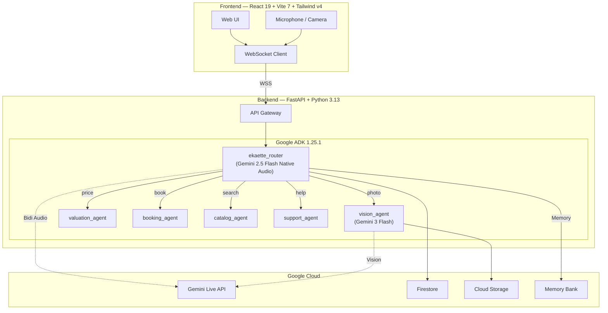

# Ekaette — Multimodal AI Customer Service Agent

[](https://python.org)
[](https://fastapi.tiangolo.com)
[](https://google.github.io/adk-docs/)
[](https://ai.google.dev/gemini-api/docs/live)
[](https://react.dev)
[](https://tailwindcss.com)
[](https://cloud.google.com/run)
[](LICENSE)

> **Ekaette** transforms customer service through real-time multimodal AI conversations — customers speak naturally, show products via camera, negotiate prices, and book appointments, all in one voice call. Built for the [Gemini Live Agent Challenge](https://geminiliveagentchallenge.devpost.com/).

[Live Demo](https://ekaette-233619833678.us-central1.run.app) | [Demo Video](https://youtube.com/watch?v=XXXXX) | [Blog Post](https://dev.to/bassey/building-ekaette-XXXXX) | [Devpost](https://devpost.com/software/ekaette)

---

## Demo

### Video Walkthrough

<!-- TODO: Replace VIDEO_ID with your actual YouTube video ID -->
[](https://www.youtube.com/watch?v=VIDEO_ID)

### Screenshots

| Voice Conversation | Visual Inspection | Valuation & Negotiation |
|---|---|---|
|  |  |  |

---

## The Problem

Traditional e-commerce customer service forces customers into slow, text-only chatbot flows — typing descriptions of products they could simply *show*, negotiating prices through rigid forms, and navigating multi-step booking flows that should take seconds. In Nigerian markets especially, trade-in valuations, price negotiation, and appointment scheduling are deeply conversational acts that text chatbots fail to capture.

## What Ekaette Does

Ekaette is a **multimodal AI customer service agent** that handles the full trade-in lifecycle through natural voice conversation:

- **See**: Customer shows their device on camera — AI identifies the product, assesses condition, and spots damage in real-time
- **Hear**: Bidirectional audio streaming via Gemini Live API — sub-second voice responses with natural conversation flow
- **Value**: Automated condition grading and pricing with transparent rubric-based valuation
- **Negotiate**: Voice-driven price negotiation with counter-offers — just like a real market interaction
- **Book**: Appointment scheduling and pickup confirmation, all within the same voice call
- **Remember**: Long-term memory across sessions — returning customers are greeted by name with context from prior interactions

One codebase serves **multiple industries** (electronics, hotel, automotive, fashion) with per-industry voice personas, pricing rubrics, and conversation styles.

---

## Architecture



**Dual-model strategy**: The root agent uses `gemini-2.5-flash-native-audio` via the Live API for real-time voice I/O. Specialist agents use `gemini-3-flash` via the Standard API for reasoning-heavy tasks (vision analysis, pricing calculations). This keeps voice latency low while allowing deep analysis when needed.

For full architecture details including all data flows, memory tiers, and latency mitigations, see the Architecture section in the project documentation.

---

## Key Features

### Multi-Agent Orchestration

Six specialized agents coordinated by Google ADK, with LLM-driven routing:

| Agent | Role | Model |
|---|---|---|
| **ekaette_router** | Voice I/O, intent detection, agent routing | Gemini 2.5 Flash (Live API) |
| **vision_agent** | Image analysis, product identification, damage detection | Gemini 3 Flash |
| **valuation_agent** | Condition grading, price calculation, negotiation logic | Gemini 3 Flash |
| **booking_agent** | Availability checking, appointment scheduling | Gemini 3 Flash |
| **catalog_agent** | Product search, recommendations | Gemini 3 Flash |
| **support_agent** | FAQs, general inquiries (Google Search grounding) | Gemini 3 Flash |

### Real-Time Voice Streaming

Bidirectional PCM audio via Gemini Live API with:
- 16kHz capture / 24kHz playback (separate AudioContexts — no echo feedback)
- Barge-in support (interrupt the agent mid-sentence)
- Voice Activity Detection (automatic + manual fallback for noisy environments)
- Voice filler UX during agent transfers ("Let me take a closer look...")

### 3-Tier Memory Architecture

1. **Session State** (Firestore) — within-call context with key prefixes (`user:`, `app:`, `temp:`)
2. **Memory Bank** (Vertex AI Agent Engine) — cross-session long-term memory with Gemini-powered extraction and consolidation
3. **Industry Knowledge** (Firestore configs) — shared pricing rubrics, voice personas, booking rules

### Multi-Industry Support

Switch industries at onboarding — each gets its own voice persona, pricing rubric, and conversation style:
- **Electronics**: Aoede voice, device trade-in + valuation flow
- **Hotel**: Puck voice, room booking + concierge
- **Automotive**: Service scheduling + trade-in estimates
- **Fashion**: Catalog recommendations + consultation

### Direct-Live Transport Mode

Optional low-latency mode that fetches an ephemeral token from the backend and connects the browser directly to Gemini Live API — bypassing the backend WebSocket proxy for audio. Falls back automatically to backend-proxy if token generation fails.

---

## Built With

### Backend

| Technology | Version | Purpose |
|---|---|---|
| [Python](https://python.org) | 3.13 | Runtime |
| [FastAPI](https://fastapi.tiangolo.com) | 0.131 | Async API + WebSocket server |
| [Google ADK](https://google.github.io/adk-docs/) | 1.25.1 | Multi-agent orchestration |
| [Gemini Live API](https://ai.google.dev/gemini-api/docs/live) | 2.5 Flash | Real-time voice streaming |
| [Gemini 3 Flash](https://ai.google.dev) | Preview | Vision + reasoning |
| [google-genai](https://pypi.org/project/google-genai/) | 1.64.0 | Gemini SDK |

### Frontend

| Technology | Version | Purpose |
|---|---|---|
| [React](https://react.dev) | 19 | UI framework |
| [Vite](https://vite.dev) | 7 | Build tool + dev server |
| [Tailwind CSS](https://tailwindcss.com) | v4 | CSS-first utility styling |
| [TypeScript](https://typescriptlang.org) | 5.9 | Type safety |
| [@google/genai](https://www.npmjs.com/package/@google/genai) | 1.42+ | Direct-live ephemeral token transport |

### Infrastructure

| Technology | Purpose |
|---|---|
| [Google Cloud Run](https://cloud.google.com/run) | Serverless container hosting (session affinity, 60min timeout) |
| [Firestore](https://firebase.google.com/docs/firestore) | Sessions, configs, bookings |
| [Cloud Storage](https://cloud.google.com/storage) | Customer photos, ADK artifacts |
| [Vertex AI Agent Engine](https://cloud.google.com/agent-builder) | Memory Bank for long-term customer memory |
| [Terraform](https://terraform.io) | Infrastructure as Code |
| [Docker](https://docker.com) | Multi-stage container build |

---

## Getting Started

### Prerequisites

- Python 3.13+
- Node.js 20+ with pnpm
- Google Cloud account with billing enabled
- [Gemini API key](https://aistudio.google.com/apikey) (free tier works for development)

### Installation

```bash
# 1. Clone the repository
git clone https://github.com/ogabasseyy/ekaette.git
cd ekaette

# 2. Backend setup
python3 -m venv .venv
source .venv/bin/activate
pip install -r requirements.txt

# 3. Frontend setup
cd frontend
pnpm install
cd ..

# 4. Environment configuration
cp .env.example .env
# Edit .env and add your GOOGLE_API_KEY
```

### Environment Variables

See [.env.example](.env.example) for all configuration options. The minimum required for local development:

```bash
GOOGLE_API_KEY=your_gemini_api_key_here
GOOGLE_GENAI_USE_VERTEXAI=FALSE
```

### Running Locally

```bash
# Terminal 1: Backend (serves API + WebSocket on :8000)
source .venv/bin/activate
uvicorn main:app --reload --port 8000

# Terminal 2: Frontend (dev server on :5173, proxies to backend)
cd frontend
pnpm dev
```

Open [http://localhost:5173](http://localhost:5173) — select an industry, then click **Start Call** to begin a voice conversation.

### Running Tests

```bash
# Backend (212 tests)
source .venv/bin/activate
pytest tests/ -v

# Frontend (81 tests)
cd frontend
pnpm exec vitest run
```

---

## Deployment

### Docker (Manual)

```bash
# Build the multi-stage image (frontend + backend)
docker build -t ekaette .

# Run locally
docker run -p 8080:8080 --env-file .env ekaette
```

### Cloud Run (gcloud CLI)

```bash
gcloud run deploy ekaette \
  --source . \
  --region us-central1 \
  --timeout 3600 \
  --session-affinity \
  --memory 1Gi \
  --cpu 2 \
  --min-instances=1 \
  --set-env-vars "GOOGLE_GENAI_USE_VERTEXAI=TRUE"
```

### Terraform (Infrastructure as Code)

The [`terraform/`](terraform/) directory contains full IaC for provisioning all GCP resources:

```bash
cd terraform
cp terraform.tfvars.example terraform.tfvars
# Edit terraform.tfvars with your project ID and container image

terraform init
terraform plan
terraform apply
```

This provisions:
- **Cloud Run** service with session affinity + 60min timeout
- **Firestore** database (Native mode)
- **Cloud Storage** bucket with lifecycle policies
- **Artifact Registry** for Docker images
- **IAM** service account with least-privilege roles
- **7 GCP APIs** auto-enabled

---

## Project Structure

```
ekaette/
├── app/
│   ├── agents/               # Multi-agent hierarchy (6 agents)
│   │   ├── ekaette_router/   # Root agent — voice I/O + routing
│   │   ├── vision_agent/     # Image analysis
│   │   ├── valuation_agent/  # Condition grading + pricing
│   │   ├── booking_agent/    # Appointment scheduling
│   │   ├── catalog_agent/    # Product search
│   │   └── support_agent/    # FAQ + Google Search grounding
│   ├── configs/              # Industry config loaders
│   ├── memory/               # Memory Bank factory
│   └── tools/                # Agent tool implementations
├── frontend/
│   └── src/
│       ├── components/       # React UI components
│       ├── hooks/            # useEkaetteSocket, useAudioWorklet, useDemoMode
│       ├── lib/              # Utilities (format, transcript, cn)
│       └── types/            # TypeScript interfaces (12 ServerMessage types)
├── terraform/                # GCP Infrastructure as Code
├── tests/                    # Backend test suite (212 tests)
├── main.py                   # FastAPI application entry
├── Dockerfile                # Multi-stage build (Node + Python)
└── seed_data.py              # Firestore data seeding
```

---

## Challenges & Learnings

### AudioWorklet Echo Feedback

The starter code connected the microphone recorder to `ctx.destination`, creating a mic → speaker → mic feedback loop. Fix: separate 16kHz (recorder) and 24kHz (player) AudioContexts, and never connect the recorder to output.

### ADK Bug #3395 — Duplicate Responses

After multiple agent transfers, the ADK would replay earlier responses. Mitigated with a `before_agent_callback` that tracks content hashes and suppresses duplicates.

### Gemini Live API Session Limits

Sessions are limited to ~10 minutes. Implemented session resumption with `SessionResumptionUpdate` tokens and context compression (trigger at 80k tokens, compress to 40k sliding window) for longer conversations.

### Voice Latency During Agent Transfers

Agent transfers introduce 5-10 seconds of silence. Solved with voice filler instructions ("Let me take a closer look...") baked into the root agent, plus `NON_BLOCKING` tool behavior and `WHEN_IDLE` scheduling for tool results.

---

## What's Next

- **WaxalNLP voice cloning** — Custom Nigerian-accented voice persona for culturally authentic interactions
- **Vertex AI Search RAG** — Replace Firestore catalog queries with semantic multimodal search over product catalogs
- **Multi-language support** — Yoruba, Igbo, and Pidgin English alongside standard English
- **Mobile-native app** — React Native with on-device AudioWorklet for lower latency
- **Analytics dashboard** — Real-time session monitoring, conversion funnels, and cost tracking

---

## Team

**Bassey** — Baci Technologies Limited

Built as a solo entry for the [Gemini Live Agent Challenge](https://geminiliveagentchallenge.devpost.com/) (March 2026).

---

## License

This project is licensed under the MIT License — see the [LICENSE](LICENSE) file for details.

---

## Acknowledgments

- [Google ADK](https://google.github.io/adk-docs/) and the [bidi-demo sample](https://github.com/google/adk-samples) for the foundational streaming architecture
- [Gemini Live API](https://ai.google.dev/gemini-api/docs/live) for real-time multimodal capabilities
- The [Gemini Live Agent Challenge](https://geminiliveagentchallenge.devpost.com/) organizers for the prompt and resources
