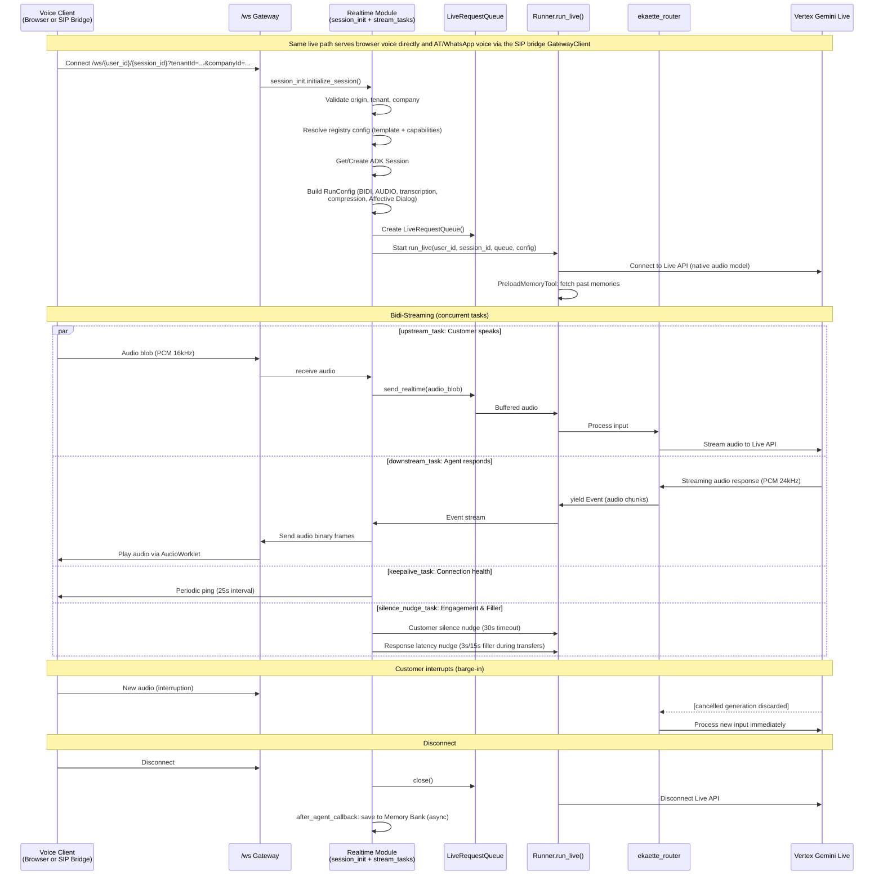
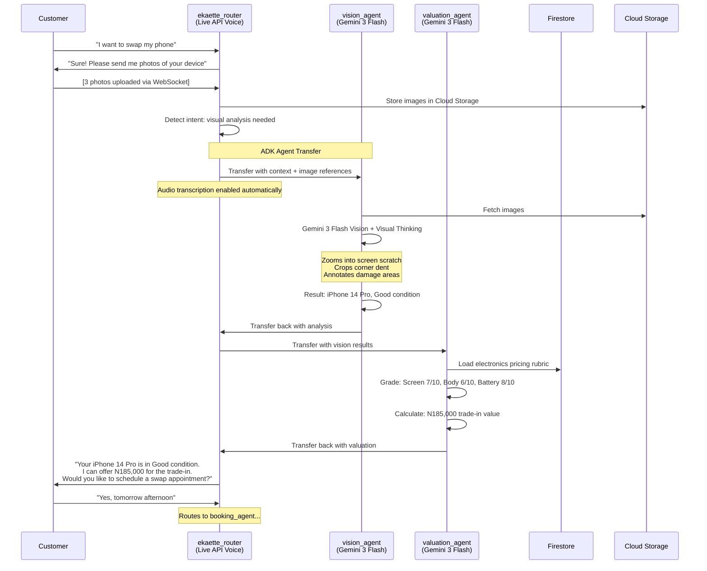
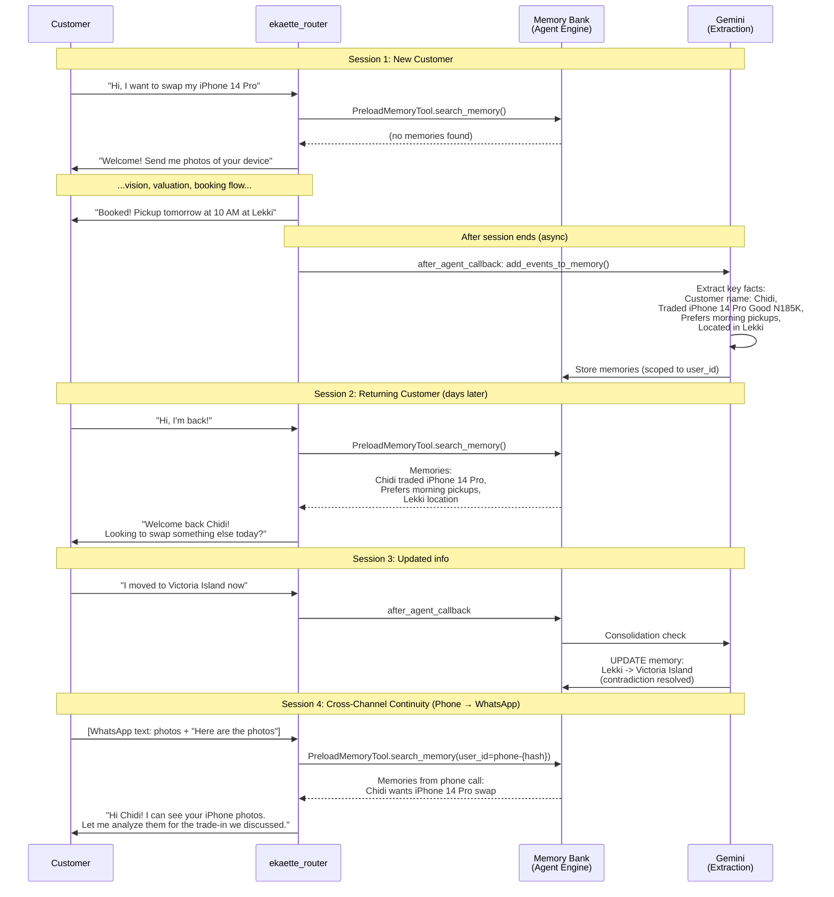
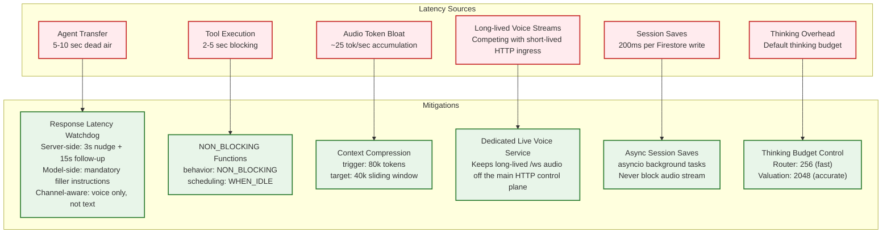

# Voice & Agent Flows

> Part of [Ekaette System Architecture](../../Ekaette_Architecture.md)

## Voice Conversation Flow (Dedicated Live Voice Service)

### Affective Dialog

The Live `RunConfig`'s `Affective Dialog` setting lets the native-audio model adapt prosody, pacing, and phrasing to the caller's emotional tone without changing routing, safety policy, or tool permissions.

In this architecture it should improve:
- warmer or calmer spoken delivery when the caller sounds frustrated or uncertain
- more natural acknowledgement language during transfers and callbacks
- smoother voice UX without changing business logic

It should not be treated as:
- a replacement for routing rules
- a safety or policy mechanism
- permission to improvise outside the configured agent and tool boundaries

---

## Multi-Agent Transfer Flow (Image During Voice Call)

---

## Learning Layer Flow (Memory Bank)

---

## Latency Mitigation Architecture

