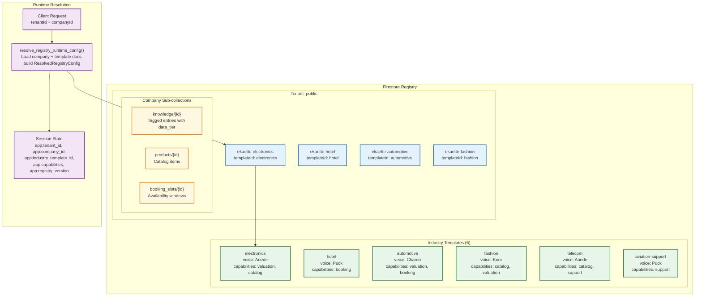
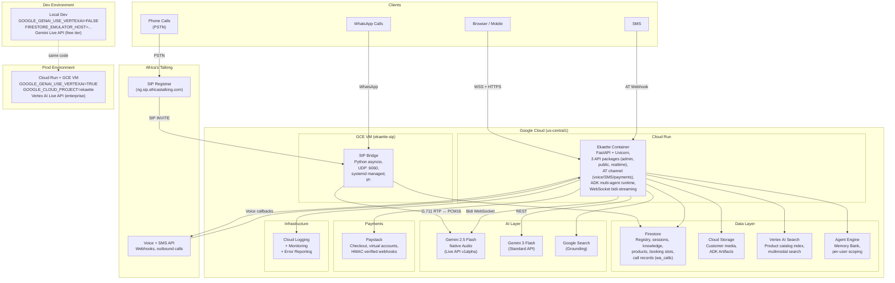

# Registry & Deployment

> Part of [Ekaette System Architecture](../../Ekaette_Architecture.md)

## Multi-Tenant Registry Architecture

```mermaid
graph TB
    subgraph "Firestore Registry"
        subgraph "Industry Templates (6)"
            T_ELEC["electronics<br/>voice: Aoede<br/>capabilities: valuation, catalog"]
            T_HOTEL["hotel<br/>voice: Puck<br/>capabilities: booking"]
            T_AUTO["automotive<br/>voice: Charon<br/>capabilities: valuation, booking"]
            T_FASHION["fashion<br/>voice: Kore<br/>capabilities: catalog, valuation"]
            T_TELECOM["telecom<br/>voice: Aoede<br/>capabilities: catalog, support"]
            T_AVIATION["aviation-support<br/>voice: Puck<br/>capabilities: support"]
        end

        subgraph "Tenant: public"
            C_ELEC["ekaette-electronics<br/>templateId: electronics"]
            C_HOTEL["ekaette-hotel<br/>templateId: hotel"]
            C_AUTO["ekaette-automotive<br/>templateId: automotive"]
            C_FASHION["ekaette-fashion<br/>templateId: fashion"]

            subgraph "Company Sub-collections"
                KNOW["knowledge/{id}<br/>Tagged entries with data_tier"]
                PROD["products/{id}<br/>Catalog items"]
                SLOTS["booking_slots/{id}<br/>Availability windows"]
            end
        end
    end

    subgraph "Runtime Resolution"
        REQ["Client Request<br/>tenantId + companyId"]
        RESOLVE["resolve_registry_runtime_config()<br/>Load company + template docs,<br/>build ResolvedRegistryConfig"]
        STATE["Session State<br/>app:tenant_id, app:company_id,<br/>app:industry_template_id,<br/>app:capabilities, app:registry_version"]
    end

    REQ --> RESOLVE
    RESOLVE --> C_ELEC
    C_ELEC --> T_ELEC
    RESOLVE --> STATE

    classDef template fill:#E8F5E9,stroke:#2E7D32,stroke-width:2px
    classDef company fill:#E3F2FD,stroke:#1565C0,stroke-width:2px
    classDef collection fill:#FFF8E1,stroke:#F57F17,stroke-width:2px
    classDef runtime fill:#F3E5F5,stroke:#6A1B9A,stroke-width:2px

    class T_ELEC,T_HOTEL,T_AUTO,T_FASHION,T_TELECOM,T_AVIATION template
    class C_ELEC,C_HOTEL,C_AUTO,C_FASHION company
    class KNOW,PROD,SLOTS collection
    class REQ,RESOLVE,STATE runtime
```

---

## Deployment Architecture

```mermaid
graph TB
    subgraph "Clients"
        BROWSER["Browser / Mobile"]
        PHONE["Phone Calls<br/>(PSTN)"]
        WA_CLIENT["WhatsApp Calls"]
        SMS_CLIENT["SMS"]
    end

    subgraph "Africa's Talking"
        AT_REG["SIP Registrar<br/>(ng.sip.africastalking.com)"]
        AT_API["Voice + SMS API<br/>Webhooks, outbound calls"]
    end

    subgraph "Google Cloud (us-central1)"
        subgraph "Cloud Run"
            CR["Ekaette Container<br/>FastAPI + Uvicorn,<br/>3 API packages (admin, public, realtime),<br/>AT channel (voice/SMS/payments),<br/>ADK multi-agent runtime,<br/>WebSocket bidi-streaming"]
        end

        subgraph "GCE VM (ekaette-sip)"
            SIP_BR["SIP Bridge<br/>Python asyncio,<br/>UDP :6060,<br/>systemd managed,<br/>IP: <reserved-static-ip>"]
        end

        subgraph "Data Layer"
            FS["Firestore<br/>Registry, sessions, knowledge,<br/>products, booking slots,<br/>call records (wa_calls)"]
            CS["Cloud Storage<br/>Customer media,<br/>ADK Artifacts"]
            VAS["Vertex AI Search<br/>Product catalog index,<br/>multimodal search"]
            AE["Agent Engine<br/>Memory Bank,<br/>per-user scoping"]
        end

        subgraph "AI Layer"
            LIVE["Gemini 2.5 Flash<br/>Native Audio<br/>(Live API v1alpha)"]
            STANDARD["Gemini 3 Flash<br/>(Standard API)"]
            GSEARCH["Google Search<br/>(Grounding)"]
        end

        subgraph "Payments"
            PAYSTACK["Paystack<br/>Checkout, virtual accounts,<br/>HMAC-verified webhooks"]
        end

        subgraph "Infrastructure"
            LOG["Cloud Logging<br/>+ Monitoring<br/>+ Error Reporting"]
        end
    end

    BROWSER -->|"WSS + HTTPS"| CR
    PHONE -->|"PSTN"| AT_REG
    AT_REG -->|"SIP INVITE"| SIP_BR
    WA_CLIENT -->|"WhatsApp"| SIP_BR
    SMS_CLIENT -->|"AT Webhook"| CR
    AT_API -->|"Voice callbacks"| CR

    SIP_BR -->|"G.711 RTP ↔ PCM16"| LIVE
    SIP_BR --> FS

    CR --> FS
    CR --> CS
    CR --> VAS
    CR --> AE
    CR -->|"Bidi WebSocket"| LIVE
    CR -->|"REST"| STANDARD
    CR --> GSEARCH
    CR --> LOG
    CR --> AT_API
    CR --> PAYSTACK

    subgraph "Dev Environment"
        DEV["Local Dev<br/>GOOGLE_GENAI_USE_VERTEXAI=FALSE<br/>FIRESTORE_EMULATOR_HOST=...<br/>Gemini Live API (free tier)"]
    end

    subgraph "Prod Environment"
        PROD["Cloud Run + GCE VM<br/>GOOGLE_GENAI_USE_VERTEXAI=TRUE<br/>GOOGLE_CLOUD_PROJECT=ekaette<br/>Vertex AI Live API (enterprise)"]
    end

    DEV -.->|"same code"| PROD
```
