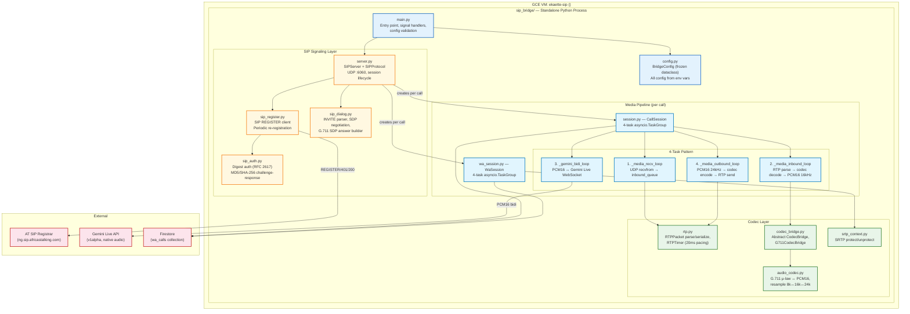
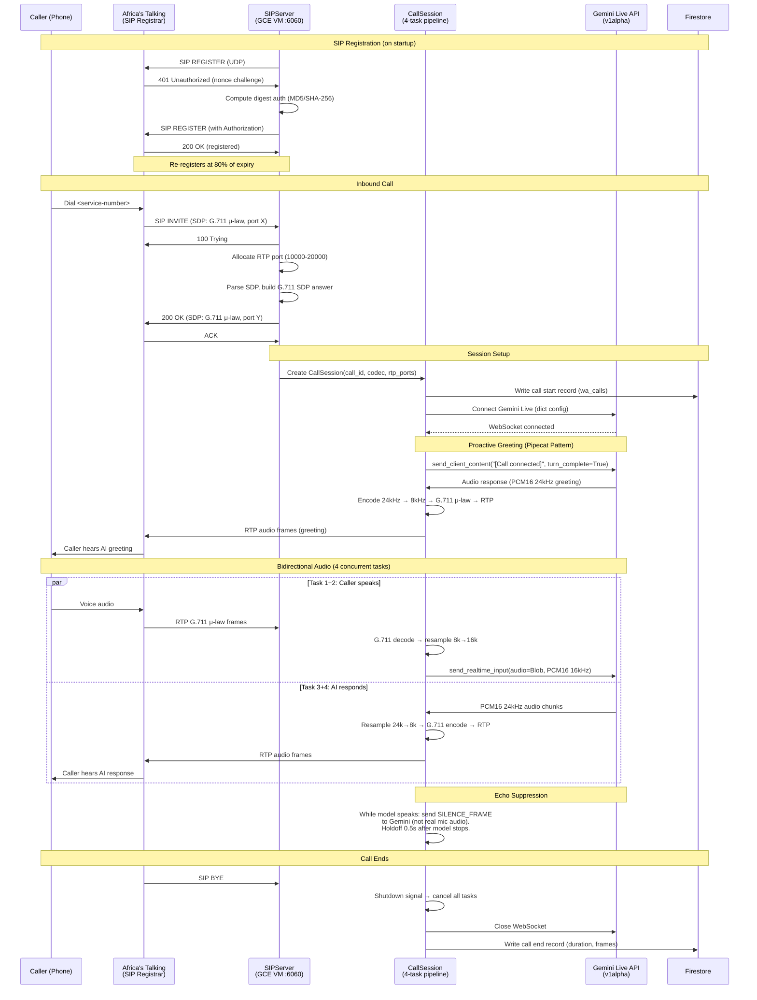
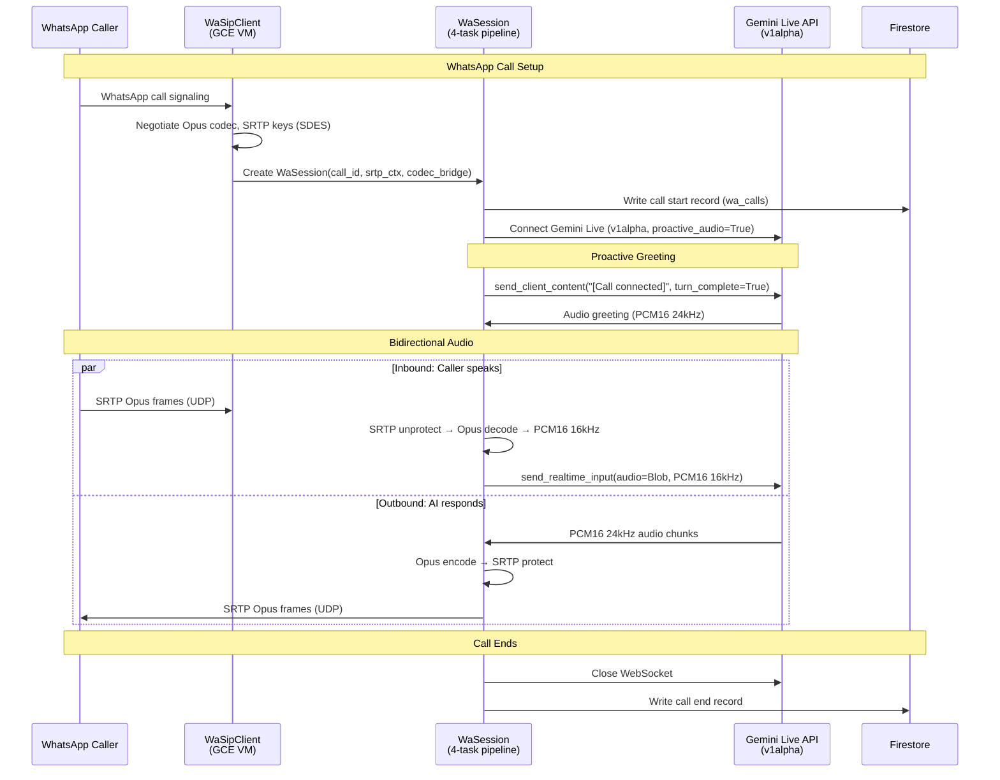
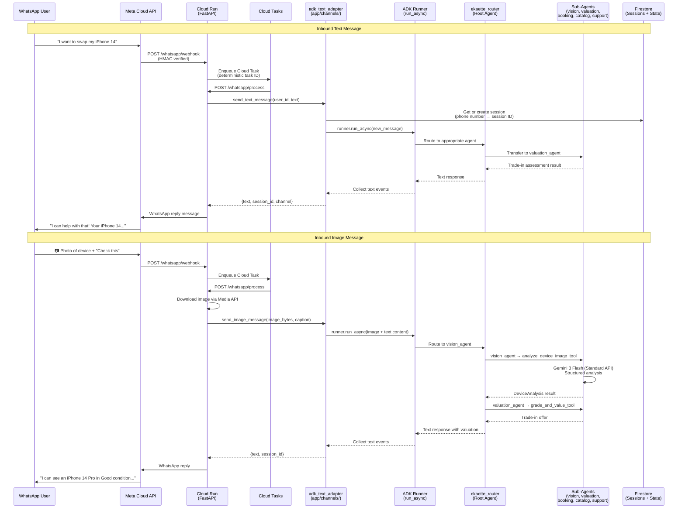
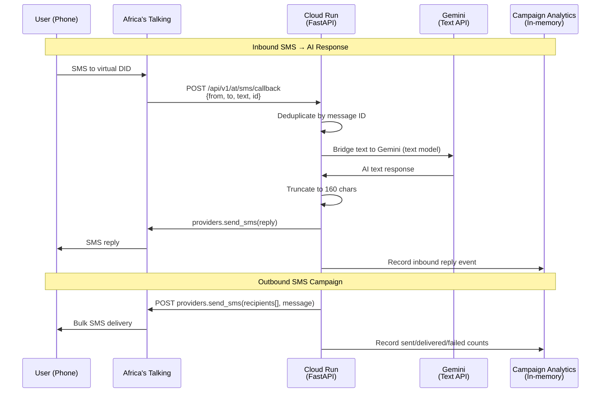
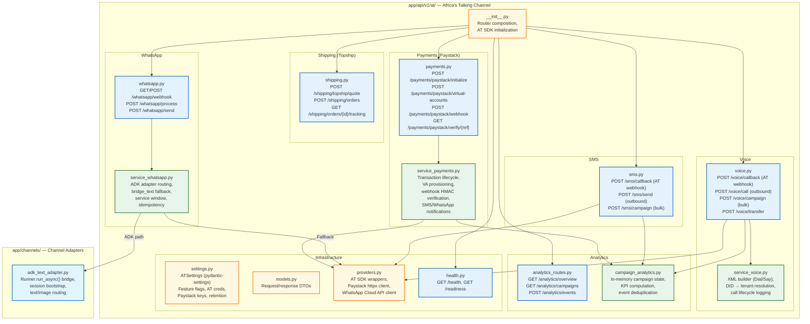

# Telephony & Channel Integration

> Part of [Ekaette System Architecture](../../Ekaette_Architecture.md)

## SIP Bridge Architecture (GCE VM)

---

## Inbound Phone Call Flow (AT → SIP Bridge → Gemini)

---

## WhatsApp Call Flow (Opus/SRTP → Gemini)

---

## WhatsApp Text/Image → ADK Agent Graph

WhatsApp text and image messages now route through the full ADK agent hierarchy
via `app/channels/adk_text_adapter.py`. This gives WhatsApp users access to all
5 sub-agents (vision, valuation, booking, catalog, support), session state,
tools, and memory — the same capabilities as the voice WebSocket channel.

### Key Design Decisions

- **Session continuity**: Phone number → deterministic session ID via SHA-256 hash.
  Same user maintains multi-turn conversation state across messages.
- **Graceful fallback**: If ADK Runner is not initialized (early startup, tests),
  falls back to `bridge_text.py` (standalone Gemini, no agents).
- **Channel limits**: WhatsApp 4096 chars, SMS 160 chars — enforced by adapter.
- **No audio overhead**: Uses `Runner.run_async()` (text mode, `StreamingMode.NONE`)
  instead of `Runner.run_live()` (bidi streaming). Faster, cheaper.

---

## SMS Text Bridge Flow

SMS currently uses `bridge_text.py` (standalone Gemini). Future: route through
`adk_text_adapter` for full agent capabilities (same pattern as WhatsApp).

---

## AT Channel Module Architecture

