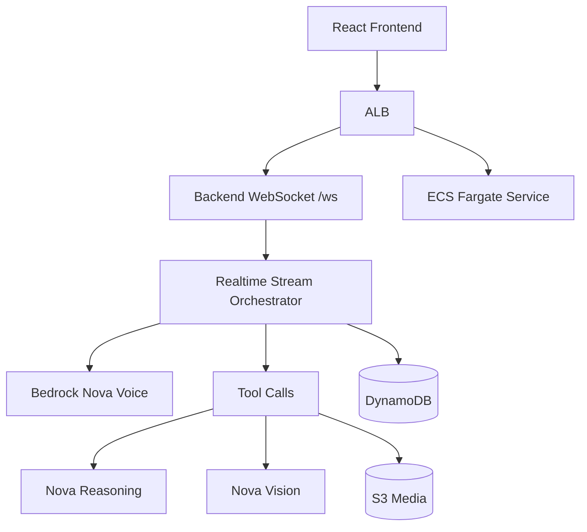

# Nova Runtime Architecture

```mermaid
graph TB
    UI[React Frontend] --> ALB[ALB]
    ALB --> WS[Backend WebSocket /ws]
    WS --> RT[Realtime Stream Orchestrator]
    RT --> NOVA[Bedrock Nova Voice]
    RT --> TOOLS[Tool Calls]
    TOOLS --> TXT[Nova Reasoning]
    TOOLS --> VIS[Nova Vision]
    RT --> DDB[(DynamoDB)]
    TOOLS --> S3[(S3 Media)]
    ALB --> ECS[ECS Fargate Service]
```
