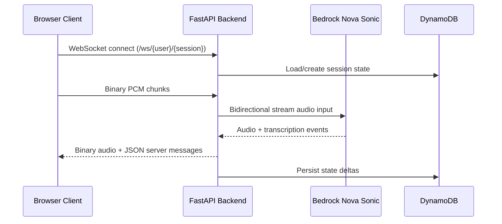

# Realtime Proxy Sequence

```mermaid
sequenceDiagram
    participant C as Browser Client
    participant B as FastAPI Backend
    participant N as Bedrock Nova Sonic
    participant D as DynamoDB

    C->>B: WebSocket connect (/ws/{user}/{session})
    B->>D: Load/create session state
    C->>B: Binary PCM chunks
    B->>N: Bidirectional stream audio input
    N-->>B: Audio + transcription events
    B-->>C: Binary audio + JSON server messages
    B->>D: Persist state deltas
```

